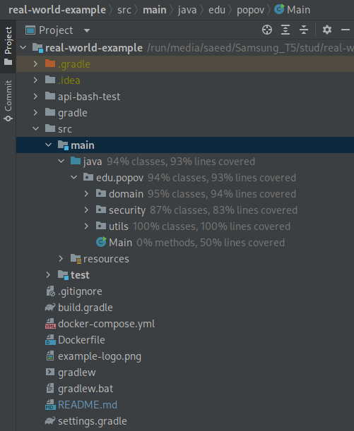

# 

> ### Spring Boot codebase containing real world examples (CRUD, auth, advanced patterns, etc) that adheres to the [RealWorld](https://github.com/gothinkster/realworld) spec and API

Приложение разработано на основе спецификации [real-world-app](https://realworld-docs.netlify.app/docs/specs/backend-specs/endpoints).

### Highlights
- Приложение построено на основе трехслоиной архитектуры (api, services, repository)
- Security построено на основе jwt токенов
- Обработка исключений с помощью @ControllerAdvice
- Таблицы, constraints и внешние ключи генерируются с помощью Jpa
- DTO в качестве классов оберток для api запросов и ответов

Также:
* [endpoints and json examples](https://realworld-docs.netlify.app/docs/specs/backend-specs/endpoints)
* [api json answer formats](https://realworld-docs.netlify.app/docs/specs/backend-specs/api-response-format)

### Technology
- Spring Boot 3.0.0 и Java 17
- Spring Data JPA + Hibernate + H2 database ([запуск на PostgreSQL](#PostgreSQL))
- Spring Security 6 + jwt
- Spring Validation для валидации rest запросов
- Jackson для сериализации и дессериализации запросов и ответов
- JUnit 5 + AssertJ для тестирования

### Getting started
Требуется Java 17 или выше

    ./gradlew bootRun

Для тестирования работоспособности приложения в браузере http://localhost:8080/api/tags.  
Или же через команду в терминале

    curl http://localhost:8080/api/tags

### Testing

Для запуска тестов следующая команда

    ./gradlew test

Процент покрытия строк кода тестами 89%.
##### 

### Docker run

Убедитесь что Docker engine запущени командой `docker --version`. Если Docker
не установлен, то [вот гайд по установке Docker](https://github.com/ModiconMe/docker/blob/main/installation.md).

Для запуска приложения в докер контейнере в корне проекта запускаем команду
для построения докер образа.

`docker build -t realworld:v1 .`

После построения образа создаем и запускаем контейер с помощью docker run

`docker run --name realworld -p 8080:8080 realworld:v1`

После этого можно [протестировать работоспособность](#Testing)

